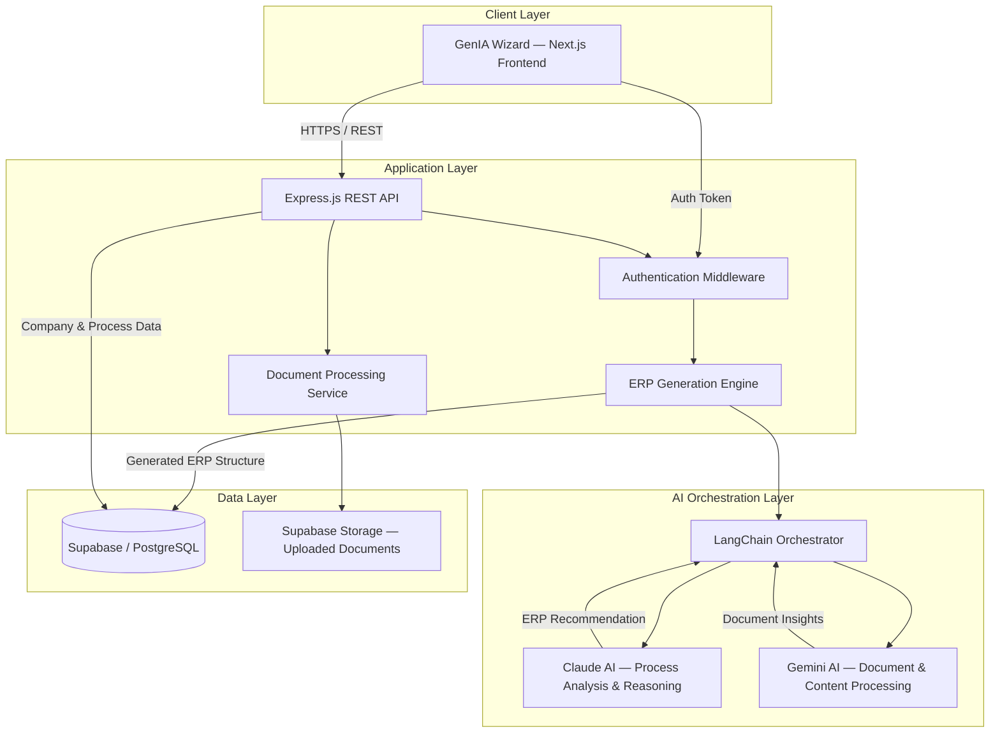
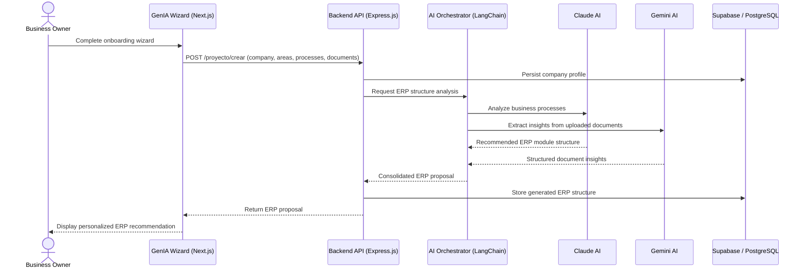
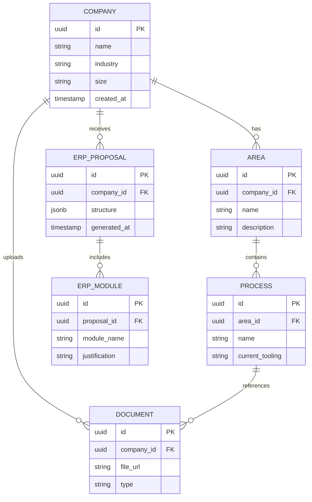

# team-15 Platanus Hack 26: CDMX Project

<p align="center">
  
</p>

<h1 align="center">GenIA ERP Builder</h1>

<p align="center">
  <b>AI-generated, custom-fit ERP systems for small and medium businesses.</b>
</p>

<p align="center">
  <a href="#">Live Demo</a> ·
  <a href="#installation">Installation</a> ·
  <a href="#architecture-overview">Architecture</a> ·
  <a href="#future-roadmap">Roadmap</a> ·
  <a href="#team">Team</a>
</p>

<p align="center">
  
  
  
</p>

<p align="center">
  
  
  
  
  
  
  
  
  
  
  
  
</p>

<p align="center">
  Frontend: <a href="#">your-deploy-url.vercel.app</a> &nbsp;|&nbsp; API: <a href="#">your-api-url.onrender.com</a>
</p>

---

## Table of Contents

- [Problem Statement](#problem-statement)
- [Solution Overview](#solution-overview)
- [Key Features](#key-features)
- [Architecture Overview](#architecture-overview)
- [System Architecture Diagram](#system-architecture-diagram)
- [Tech Stack](#tech-stack)
- [Project Structure](#project-structure)
- [Installation](#installation)
- [Environment Variables](#environment-variables)
- [Running Locally](#running-locally)
- [Deployment](#deployment)
- [Future Roadmap](#future-roadmap)
- [Team](#team)
- [Lessons Learned](#lessons-learned)
- [Contributing](#contributing)
- [License](#license)
- [Acknowledgments](#acknowledgments)

---

## Problem Statement

Most small and medium-sized businesses do not run on an ERP. Instead, they operate through a patchwork of spreadsheets, shared documents, messaging threads, and manual processes that were never designed to scale.

This happens because traditional ERP implementations are:

- **Expensive** — licensing and consulting costs are typically out of reach for SMBs.
- **Slow** — implementations often take months of discovery, configuration, and customization.
- **Generic** — most platforms force the business to adapt to the software, rather than the other way around.
- **Complex to scope** — defining the right modules, processes, and data structures requires specialized consultants that SMBs rarely have access to.

As a result, businesses keep growing on top of fragile, manual infrastructure, accumulating operational debt that becomes harder to unwind the longer it persists.

## Solution Overview

**GenIA ERP Builder** uses AI to remove the discovery and scoping bottleneck that makes ERP adoption slow and expensive.

The platform guides a business owner through a structured onboarding flow that captures the information a consultant would normally gather manually: company profile, organizational areas, operational processes, and existing documentation. This information is then analyzed by an AI pipeline that proposes a tailored ERP structure — modules, entities, and workflows — specific to how that business actually operates.

The result is a significant reduction in the time, cost, and complexity typically associated with designing and deploying an ERP system, while keeping a human in the loop to validate and refine the proposal.

## Key Features

| Feature | Description |
|---|---|
| Guided onboarding wizard | Step-by-step flow that captures company data, organizational areas, processes, and supporting documents. |
| AI-driven ERP analysis | Claude AI analyzes business processes and proposes a tailored ERP module structure. |
| Document understanding | Gemini AI processes uploaded documents to extract relevant operational context. |
| Personalized ERP proposal | Generates a structured, modular ERP recommendation mapped to the business's actual workflows. |
| Persistent project state | Company profiles, processes, and generated proposals are stored in Supabase / PostgreSQL. |
| Modern, responsive UI | Built with Next.js and Tailwind CSS for a fast, accessible onboarding experience. |

## Architecture Overview

GenIA ERP Builder follows a clear separation of concerns across four layers:

1. **Client Layer** — A Next.js application (the "GenIA Wizard") that guides users through onboarding and renders the generated ERP proposal.
2. **Application Layer** — An Express.js REST API responsible for authentication, request validation, document handling, and orchestrating the ERP generation workflow.
3. **AI Orchestration Layer** — A LangChain-based orchestrator that coordinates two specialized models: Claude AI for business process analysis and reasoning, and Gemini AI for document and content processing.
4. **Data Layer** — Supabase (PostgreSQL) for relational data and authentication, and Supabase Storage for uploaded documents.

This layered design keeps the AI orchestration logic decoupled from the API surface, making it straightforward to add new AI providers, new document types, or new ERP module templates without affecting the rest of the system.

## System Architecture Diagram



### Request Flow — ERP Proposal Generation



### Core Data Model



## Tech Stack

### Frontend

| Technology | Purpose |
|---|---|
| Next.js | React framework providing routing, SSR/SSG, and performance optimizations. |
| React | Component-based architecture for the onboarding wizard and dashboard. |
| TypeScript | Static typing across the client codebase. |
| Axios | HTTP client for communication with the backend API. |
| Tailwind CSS | Utility-first styling system for a consistent, responsive UI. |

### Backend

| Technology | Purpose |
|---|---|
| Node.js | JavaScript runtime powering the API server. |
| Express.js | REST API framework handling routing and middleware. |
| TypeScript | Static typing and improved maintainability across services and controllers. |

### Database & Storage

| Technology | Purpose |
|---|---|
| Supabase | Backend-as-a-service: authentication, Postgres database, and file storage. |
| PostgreSQL | Relational database underlying Supabase, storing companies, processes, and generated ERP structures. |

### Artificial Intelligence

| Technology | Purpose |
|---|---|
| Claude AI (Anthropic) | Core reasoning engine: analyzes business processes and proposes ERP module structures. |
| Gemini AI (Google) | Processes and extracts structured insights from uploaded business documents. |
| LangChain | Orchestrates the multi-model AI workflow between Claude AI and Gemini AI. |

### Deployment & Infrastructure

| Technology | Purpose |
|---|---|
| Vercel | Hosting and CI/CD for the Next.js frontend. |
| Render | Hosting for the Express.js backend service. |

### Version Control

| Technology | Purpose |
|---|---|
| Git | Source control. |
| GitHub | Repository hosting and team collaboration. |

## Project Structure

```
genia-erp-builder/
├── frontend/                   # Next.js application (GenIA Wizard)
│   ├── app/                    # App Router pages and layouts
│   ├── components/             # Reusable UI components
│   ├── lib/                    # API clients, hooks, utilities
│   ├── public/                 # Static assets
│   ├── styles/                 # Global and Tailwind styles
│   ├── .env.local.example
│   └── package.json
│
├── backend/                    # Express.js API (genia_server)
│   ├── src/
│   │   ├── controllers/        # Route controllers (e.g., erpAgentController)
│   │   ├── routes/             # Express route definitions
│   │   ├── services/           # AI orchestration and business logic
│   │   ├── middleware/         # Auth, validation, error handling
│   │   ├── config/             # Supabase client, environment setup
│   │   └── server.js           # Application entry point
│   ├── .env.example
│   └── package.json
│
├── database/
│   └── schema.sql              # Supabase / PostgreSQL schema
│
├── docs/
│   └── architecture.md         # Extended architecture notes
│
├── project-logo.png
├── README.md
└── LICENSE
```

> Note: adjust this tree to match your actual repository layout if it diverges from the structure above.

## Installation

### Prerequisites

| Requirement | Version |
|---|---|
| Node.js | 18.x or higher |
| npm / yarn / pnpm | Latest stable |
| Git | Latest stable |
| Supabase project | Active project with database and storage enabled |
| Anthropic API key | Required for Claude AI access |
| Google AI API key | Required for Gemini AI access |

### Clone the repository

```bash
git clone https://github.com/<org>/genia-erp-builder.git
cd genia-erp-builder
```

### Install dependencies

```bash
# Backend
cd backend
npm install

# Frontend
cd ../frontend
npm install
```

## Environment Variables

### Backend (`backend/.env`)

| Variable | Description |
|---|---|
| `PORT` | Port the Express server listens on. |
| `NODE_ENV` | Runtime environment (`development` / `production`). |
| `SUPABASE_URL` | URL of your Supabase project. |
| `SUPABASE_SERVICE_ROLE_KEY` | Service role key used for privileged server-side operations. |
| `SUPABASE_ANON_KEY` | Anonymous/public key used for client-safe operations. |
| `ANTHROPIC_API_KEY` | API key for Claude AI. |
| `GOOGLE_GEMINI_API_KEY` | API key for Gemini AI. |
| `JWT_SECRET` | Secret used to sign authentication tokens. |
| `CORS_ORIGIN` | Allowed origin for cross-origin requests (frontend URL). |

```bash
# backend/.env.example
PORT=4000
NODE_ENV=development

SUPABASE_URL=https://your-project.supabase.co
SUPABASE_SERVICE_ROLE_KEY=your-supabase-service-role-key
SUPABASE_ANON_KEY=your-supabase-anon-key

ANTHROPIC_API_KEY=your-anthropic-api-key
GOOGLE_GEMINI_API_KEY=your-gemini-api-key

JWT_SECRET=your-jwt-secret
CORS_ORIGIN=http://localhost:3000
```

### Frontend (`frontend/.env.local`)

| Variable | Description |
|---|---|
| `NEXT_PUBLIC_API_BASE_URL` | Base URL of the backend API. |
| `NEXT_PUBLIC_SUPABASE_URL` | URL of your Supabase project. |
| `NEXT_PUBLIC_SUPABASE_ANON_KEY` | Public Supabase key used by the client. |

```bash
# frontend/.env.local.example
NEXT_PUBLIC_API_BASE_URL=http://localhost:4000
NEXT_PUBLIC_SUPABASE_URL=https://your-project.supabase.co
NEXT_PUBLIC_SUPABASE_ANON_KEY=your-supabase-anon-key
```

> Never commit real `.env` files. Only commit `.env.example` files with placeholder values.

## Running Locally

```bash
# Terminal 1 — start the backend
cd backend
npm run dev
# API available at http://localhost:4000

# Terminal 2 — start the frontend
cd frontend
npm run dev
# App available at http://localhost:3000
```

Once both services are running, open `http://localhost:3000` to start the onboarding wizard against your local backend.

## Deployment

| Component | Platform | Notes |
|---|---|---|
| Frontend | Vercel | Connect the `frontend` directory, set environment variables in the project dashboard, auto-deploys on push to `main`. |
| Backend | Render | Deploy `backend` as a Web Service, set the build command (`npm install`) and start command (`npm start`), configure environment variables in the Render dashboard. |
| Database | Supabase | Managed Postgres instance; run `database/schema.sql` via the Supabase SQL editor to provision tables. |

After deploying, update `NEXT_PUBLIC_API_BASE_URL` on Vercel to point to the live Render URL, and update `CORS_ORIGIN` on Render to point to the live Vercel URL.

## Future Roadmap

| Phase | Feature | Status |
|---|---|---|
| Phase 1 | Guided company onboarding wizard | Completed |
| Phase 1 | AI-driven ERP structure generation | Completed |
| Phase 2 | Multi-tenant workspace support | Planned |
| Phase 2 | Editable, customizable ERP module proposals | Planned |
| Phase 3 | Integrations with accounting and invoicing platforms | Planned |
| Phase 3 | Self-service deployment of generated ERP instances | Planned |
| Phase 4 | Analytics dashboard for adoption and usage metrics | Exploring |
| Phase 4 | Marketplace for community-contributed ERP module templates | Exploring |

## Team

GenIA ERP Builder was built end-to-end — frontend, backend, AI integration, and data modeling — by a five-person team during Platanus Hack 2026 in Mexico City.

| Name | GitHub |
|---|---|
| Sanchez Cano Alejandro | [@alejandrotrikitrakatelas33sanchezcano](https://github.com/alejandrotrikitrakatelas33sanchezcano) |
| Marco André García Carballo | [@ok-andre](https://github.com/ok-andre) |
| Edgar Rafael Guerra Salinas | [@rafsa07](https://github.com/rafsa07) |
| César Arturo Bernal Linares | [@cesarabl73](https://github.com/cesarabl73) |
| Uriel Natanael Mayorga García | [@tyrael76](https://github.com/tyrael76) |

## Lessons Learned

- **ESM module resolution** — Adopting native ES Modules in the backend required explicit `.js` extensions on relative imports and careful sequencing of environment-variable loading to avoid race conditions between `dotenv` initialization and Supabase client creation.
- **Multi-model AI orchestration** — Coordinating Claude AI and Gemini AI in a single pipeline required disciplined schema design so that outputs from both models could be merged into one consistent ERP proposal.
- **Schema management for hosted Postgres** — Adapting a relational schema for execution inside Supabase's SQL editor required adding the `pgcrypto` extension for UUID generation, idempotency guards, and transaction wrapping for safe re-runs.
- **Collaborative environment configuration** — Working across a distributed team surfaced the importance of protecting `.env` configuration during merges, which led to more disciplined environment-variable handling and reduced configuration drift.

## Contributing

Contributions are welcome. To propose a change:

1. Fork the repository.
2. Create a feature branch (`git checkout -b feature/your-feature`).
3. Commit your changes with clear, descriptive messages.
4. Open a pull request describing the motivation and scope of the change.

Please open an issue first for significant changes so they can be discussed before implementation.

## License

This project is licensed under the [MIT License](./LICENSE).

> Add a `LICENSE` file at the repository root with the full MIT license text, or replace this section if a different license applies.

## Acknowledgments

- Built during **Platanus Hack 2026**, Mexico City, in the **Legacy** track.
- Thanks to the Platanus Hack organizing team and mentors for their guidance throughout the event.
- Powered by Claude AI (Anthropic) and Gemini AI (Google) for the core AI reasoning and document-processing capabilities.
