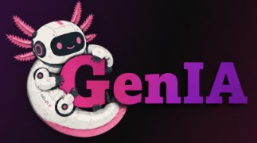
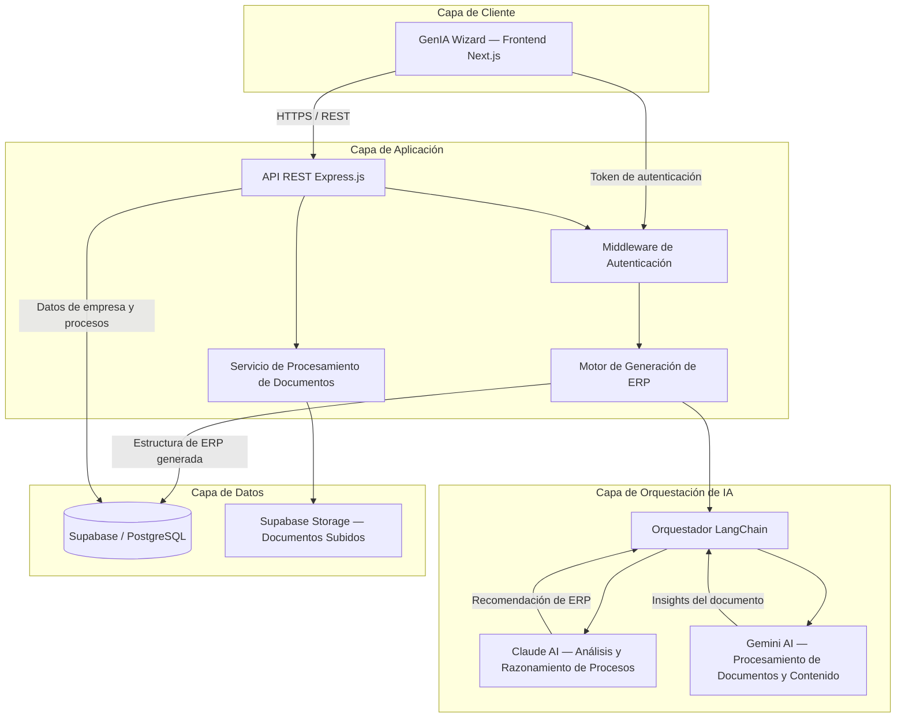
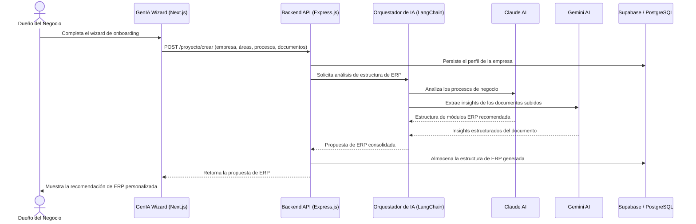

# team-15 Platanus Hack 26: CDMX Project

<p align="center">
  
</p>

<h1 align="center">GenIA ERP Builder</h1>

<p align="center">
  <b>Sistemas ERP generados por IA, a la medida de pequeñas y medianas empresas.</b>
</p>

<p align="center">
  <a href="#">Demo en vivo</a> ·
  <a href="#instalación">Instalación</a> ·
  <a href="#visión-general-de-la-arquitectura">Arquitectura</a> ·
  <a href="#roadmap-futuro">Roadmap</a> ·
  <a href="#equipo">Equipo</a>
</p>

<p align="center">
  
  
  
</p>

<p align="center">
  
  
  
  
  
  
  
  
  
  
  
  
</p>

<p align="center">
  Frontend: <a href="#">your-deploy-url.vercel.app</a> &nbsp;|&nbsp; API: <a href="#">your-api-url.onrender.com</a>
</p>

---

## Tabla de Contenidos

- [Planteamiento del Problema](#planteamiento-del-problema)
- [Visión General de la Solución](#visión-general-de-la-solución)
- [Características Principales](#características-principales)
- [Visión General de la Arquitectura](#visión-general-de-la-arquitectura)
- [Diagrama de Arquitectura del Sistema](#diagrama-de-arquitectura-del-sistema)
- [Stack Tecnológico](#stack-tecnológico)
- [Estructura del Proyecto](#estructura-del-proyecto)
- [Instalación](#instalación)
- [Variables de Entorno](#variables-de-entorno)
- [Ejecución en Local](#ejecución-en-local)
- [Despliegue](#despliegue)
- [Roadmap Futuro](#roadmap-futuro)
- [Equipo](#equipo)
- [Lecciones Aprendidas](#lecciones-aprendidas)
- [Contribuir](#contribuir)
- [Licencia](#licencia)
- [Agradecimientos](#agradecimientos)

---

## Planteamiento del Problema

La mayoría de las pequeñas y medianas empresas no operan sobre un ERP. En su lugar, gestionan sus procesos mediante un mosaico de hojas de cálculo, documentos dispersos, hilos de mensajería y procesos manuales que nunca fueron diseñados para escalar.

Esto ocurre porque las implementaciones tradicionales de ERP son:

- **Costosas** — las licencias y la consultoría suelen estar fuera del alcance de las PyMEs.
- **Lentas** — las implementaciones suelen tomar meses de descubrimiento, configuración y personalización.
- **Genéricas** — la mayoría de las plataformas obligan a la empresa a adaptarse al software, en lugar de lo contrario.
- **Complejas de definir** — establecer los módulos, procesos y estructuras de datos correctos requiere consultores especializados a los que las PyMEs rara vez tienen acceso.

Como resultado, las empresas siguen creciendo sobre una infraestructura manual y frágil, acumulando deuda operativa que se vuelve más difícil de resolver mientras más tiempo pasa.

## Visión General de la Solución

**GenIA ERP Builder** utiliza inteligencia artificial para eliminar el cuello de botella de descubrimiento y definición de alcance que hace lenta y costosa la adopción de un ERP.

La plataforma guía al dueño de la empresa a través de un flujo de onboarding estructurado que recopila la información que normalmente reuniría un consultor: perfil de la empresa, áreas organizacionales, procesos operativos y documentación existente. Esta información es luego analizada por un pipeline de IA que propone una estructura ERP a la medida — módulos, entidades y flujos de trabajo — específica a la forma en que esa empresa realmente opera.

El resultado es una reducción significativa en el tiempo, costo y complejidad típicamente asociados al diseño e implementación de un sistema ERP, manteniendo siempre a una persona en el proceso para validar y refinar la propuesta.

## Características Principales

| Característica | Descripción |
|---|---|
| Wizard de onboarding guiado | Flujo paso a paso que captura datos de la empresa, áreas organizacionales, procesos y documentos de soporte. |
| Análisis de ERP con IA | Claude AI analiza los procesos del negocio y propone una estructura de módulos ERP a la medida. |
| Comprensión de documentos | Gemini AI procesa los documentos subidos para extraer contexto operativo relevante. |
| Propuesta de ERP personalizada | Genera una recomendación de ERP estructurada y modular, mapeada a los flujos de trabajo reales del negocio. |
| Estado persistente del proyecto | Los perfiles de empresa, procesos y propuestas generadas se almacenan en Supabase / PostgreSQL. |
| UI moderna y responsiva | Construida con Next.js y Tailwind CSS para una experiencia de onboarding rápida y accesible. |

## Visión General de la Arquitectura

GenIA ERP Builder sigue una clara separación de responsabilidades en cuatro capas:

1. **Capa de Cliente** — Una aplicación Next.js (el "GenIA Wizard") que guía a los usuarios durante el onboarding y muestra la propuesta de ERP generada.
2. **Capa de Aplicación** — Una API REST en Express.js responsable de la autenticación, validación de solicitudes, manejo de documentos y orquestación del flujo de generación del ERP.
3. **Capa de Orquestación de IA** — Un orquestador basado en LangChain que coordina dos modelos especializados: Claude AI para el análisis y razonamiento de procesos de negocio, y Gemini AI para el procesamiento de documentos y contenido.
4. **Capa de Datos** — Supabase (PostgreSQL) para datos relacionales y autenticación, y Supabase Storage para los documentos subidos.

Este diseño en capas mantiene la lógica de orquestación de IA desacoplada de la superficie de la API, lo que facilita agregar nuevos proveedores de IA, nuevos tipos de documentos o nuevas plantillas de módulos ERP sin afectar el resto del sistema.

## Diagrama de Arquitectura del Sistema



### Flujo de Solicitud — Generación de Propuesta de ERP



}

## Stack Tecnológico

### Frontend

| Tecnología | Propósito |
|---|---|
| Next.js | Framework de React que provee enrutamiento, SSR/SSG y optimizaciones de rendimiento. |
| React | Arquitectura basada en componentes para el wizard de onboarding y el dashboard. |
| TypeScript | Tipado estático en todo el código del cliente. |
| Axios | Cliente HTTP para la comunicación con la API del backend. |
| Tailwind CSS | Sistema de estilos utility-first para una UI consistente y responsiva. |

### Backend

| Tecnología | Propósito |
|---|---|
| Node.js | Runtime de JavaScript que impulsa el servidor de la API. |
| Express.js | Framework de API REST que maneja el enrutamiento y los middlewares. |
| TypeScript | Tipado estático y mejor mantenibilidad en servicios y controladores. |

### Base de Datos y Almacenamiento

| Tecnología | Propósito |
|---|---|
| Supabase | Backend-as-a-service: autenticación, base de datos Postgres y almacenamiento de archivos. |
| PostgreSQL | Base de datos relacional sobre la que corre Supabase, almacenando empresas, procesos y estructuras de ERP generadas. |

### Inteligencia Artificial

| Tecnología | Propósito |
|---|---|
| Claude AI (Anthropic) | Motor de razonamiento principal: analiza los procesos de negocio y propone estructuras de módulos ERP. |
| Gemini AI (Google) | Procesa y extrae insights estructurados a partir de documentos de negocio subidos. |
| LangChain | Orquesta el flujo de trabajo multi-modelo entre Claude AI y Gemini AI. |

### Despliegue e Infraestructura

| Tecnología | Propósito |
|---|---|
| Vercel | Hosting y CI/CD para el frontend en Next.js. |
| Render | Hosting para el servicio backend en Express.js. |

### Control de Versiones

| Tecnología | Propósito |
|---|---|
| Git | Control de versiones. |
| GitHub | Hosting del repositorio y colaboración en equipo. |


## Instalación

### Prerrequisitos

| Requisito | Versión |
|---|---|
| Node.js | 18.x o superior |
| npm / yarn / pnpm | Última versión estable |
| Git | Última versión estable |
| Proyecto de Supabase | Proyecto activo con base de datos y storage habilitados |
| API key de Anthropic | Requerida para el acceso a Claude AI |
| API key de Google AI | Requerida para el acceso a Gemini AI |

### Clonar el repositorio

```bash
git clone https://github.com/<org>/genia-erp-builder.git
cd genia-erp-builder
```

### Instalar dependencias

```bash
# Backend
cd backend
npm install

# Frontend
cd ../frontend
npm install
```

## Variables de Entorno

### Backend (`backend/.env`)

| Variable | Descripción |
|---|---|
| `PORT` | Puerto en el que escucha el servidor Express. |
| `NODE_ENV` | Entorno de ejecución (`development` / `production`). |
| `SUPABASE_URL` | URL de tu proyecto de Supabase. |
| `SUPABASE_SERVICE_ROLE_KEY` | Clave de service role usada para operaciones privilegiadas del lado del servidor. |
| `SUPABASE_ANON_KEY` | Clave anónima/pública usada para operaciones seguras del lado del cliente. |
| `ANTHROPIC_API_KEY` | API key para Claude AI. |
| `GOOGLE_GEMINI_API_KEY` | API key para Gemini AI. |

```bash
# backend/.env.example
PORT=4000
NODE_ENV=development

SUPABASE_URL=https://your-project.supabase.co
SUPABASE_SERVICE_ROLE_KEY=your-supabase-service-role-key
SUPABASE_ANON_KEY=your-supabase-anon-key

ANTHROPIC_API_KEY=your-anthropic-api-key
GOOGLE_GEMINI_API_KEY=your-gemini-api-key

```

### Frontend (`frontend/.env.local`)

| Variable | Descripción |
|---|---|
| `NEXT_PUBLIC_API_BASE_URL` | URL base de la API del backend. |


```bash
# frontend/.env.local.example
NEXT_PUBLIC_API_BASE_URL=http://localhost:4000

```

> Nunca subas archivos `.env` reales al repositorio. Sube únicamente archivos `.env.example` con valores de marcador de posición.

## Ejecución en Local

```bash
# Terminal 1 — iniciar el backend
cd genia_server
npm run dev
# API disponible en http://localhost:4000

# Terminal 2 — iniciar el frontend
cd genia_client
npm run dev
# App disponible en http://localhost:3000
```

Una vez que ambos servicios estén corriendo, abre `http://localhost:3000` para iniciar el wizard de onboarding contra tu backend local.

## Despliegue

| Componente | Plataforma | Notas |
|---|---|---|
| Frontend | Vercel | Conecta el directorio `frontend`, configura las variables de entorno en el dashboard del proyecto, despliega automáticamente con cada push a `main`. |
| Backend | Render | Despliega `backend` como un Web Service, configura el build command (`npm install`) y el start command (`npm start`), y define las variables de entorno en el dashboard de Render. |
| Base de Datos | Supabase | Instancia gestionada de Postgres; ejecuta `database/schema.sql` desde el editor SQL de Supabase para crear las tablas. |

Después de desplegar, actualiza `NEXT_PUBLIC_API_BASE_URL` en Vercel para que apunte a la URL de Render en producción, y actualiza `CORS_ORIGIN` en Render para que apunte a la URL de Vercel en producción.

## Roadmap Futuro

| Fase | Característica | Estado |
|---|---|---|
| Fase 1 | Wizard guiado de onboarding de empresas | Completado |
| Fase 1 | Generación de estructura de ERP mediante IA | Completado |
| Fase 2 | Propuestas de módulos ERP editables y personalizables | Completado |
| Fase 4 | Dashboard de analítica para métricas de adopción y uso | Completado |
| Fase 2 | Soporte multi-tenant por workspace | Planeado |
| Fase 3 | Integraciones con plataformas de contabilidad y facturación | Planeado |
| Fase 3 | Despliegue self-service de instancias ERP generadas | Planeado |
| Fase 4 | Marketplace de plantillas de módulos ERP de la comunidad | En exploración |

## Equipo

GenIA ERP Builder fue construido de punta a punta — frontend, backend, integración de IA y modelado de datos — por un equipo de cinco personas durante Platanus Hack 2026 en la Ciudad de México.

| Nombre | GitHub |
|---|---|
| Sanchez Cano Alejandro | [@alejandrotrikitrakatelas33sanchezcano](https://github.com/alejandrotrikitrakatelas33sanchezcano) |
| Marco André García Carballo | [@ok-andre](https://github.com/ok-andre) |
| Edgar Rafael Guerra Salinas | [@rafsa07](https://github.com/rafsa07) |
| César Arturo Bernal Linares | [@cesarabl73](https://github.com/cesarabl73) |
| Uriel Natanael Mayorga García | [@tyrael76](https://github.com/tyrael76) |

## Lecciones Aprendidas

- **Resolución de módulos ESM** — Adoptar ES Modules nativos en el backend requirió usar extensiones `.js` explícitas en los imports relativos, así como una secuencia cuidadosa en la carga de variables de entorno para evitar condiciones de carrera entre la inicialización de `dotenv` y la creación del cliente de Supabase.
- **Orquestación de IA multi-modelo** — Coordinar Claude AI y Gemini AI en un mismo pipeline requirió un diseño de esquema disciplinado para poder fusionar las salidas de ambos modelos en una sola propuesta de ERP consistente.
- **Gestión de esquemas para Postgres gestionado** — Adaptar un esquema relacional para ejecutarlo en el editor SQL de Supabase requirió agregar la extensión `pgcrypto` para la generación de UUIDs, guardas de idempotencia y el uso de transacciones para permitir re-ejecuciones seguras.
- **Configuración de entorno colaborativa** — Trabajar con un equipo distribuido evidenció la importancia de proteger la configuración del `.env` durante los merges, lo que llevó a un manejo más disciplinado de las variables de entorno y a reducir el drift de configuración.


## Licencia

Este proyecto está licenciado bajo la [Licencia MIT](./LICENSE)..

## Agradecimientos

- Construido durante **Platanus Hack 2026**, en la Ciudad de México, dentro del track **Legacy**.
- Gracias al equipo organizador y a los mentores de Platanus Hack por su acompañamiento durante el evento.
- Potenciado por Claude AI (Anthropic) y Gemini AI (Google) para las capacidades centrales de razonamiento e interpretación de documentos.
